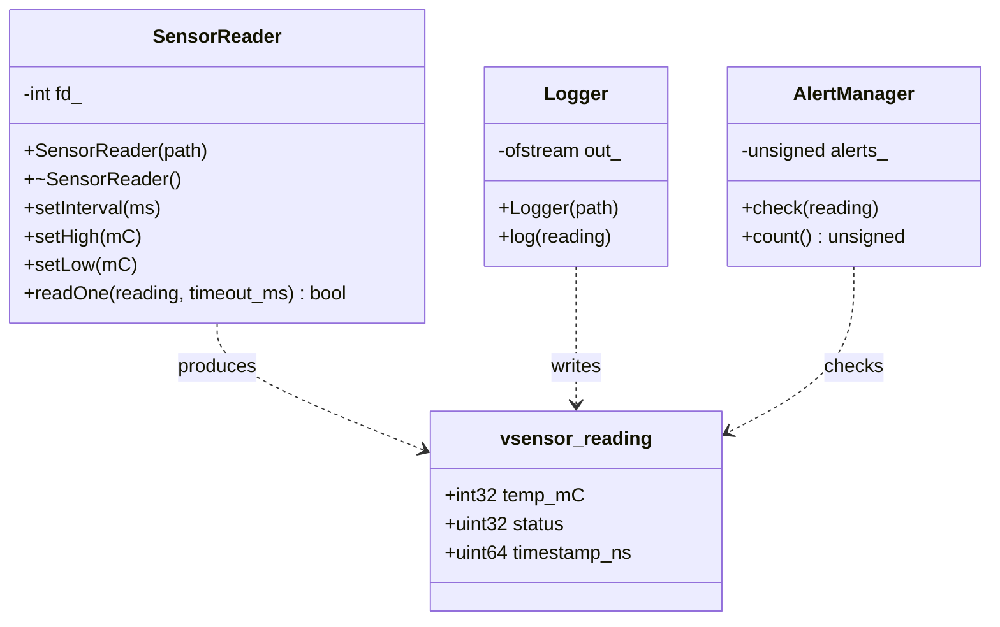
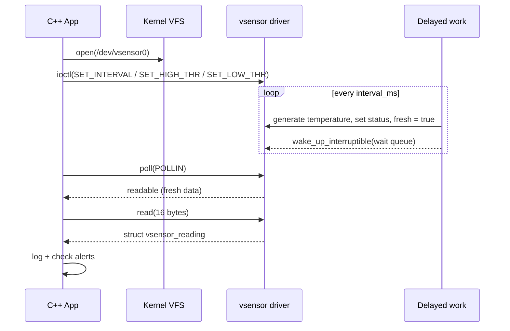
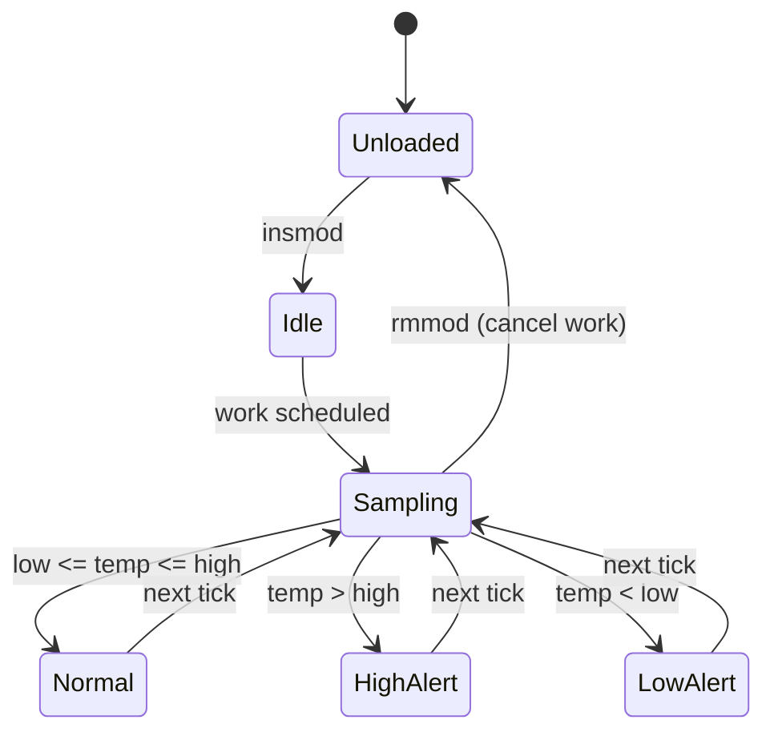

# System Design: Virtual Sensor Driver

## 1. Architecture

```mermaid
flowchart TB
    subgraph US[User Space - C++]
        APP[main: monitoring loop]
        SR[SensorReader - RAII fd, poll/read/ioctl]
        LG[Logger - vsensor.log]
        AM[AlertManager]
        APP --> SR
        APP --> LG
        APP --> AM
    end
    SR -->|open/read/poll/ioctl syscalls| SYS[System Call Interface]
    SYS --> VFS[Virtual File System /dev/vsensor0]
    subgraph KS[Kernel Space - C module]
        FOPS[file_operations: read, poll, unlocked_ioctl]
        WQ[Wait queue]
        DW[Delayed work - simulated sensor sampling]
        DATA[(struct vsensor_dev + mutex)]
        PROC[/proc/vsensor]
        FOPS --- DATA
        DW --> DATA
        DW -->|wake_up| WQ
        FOPS --- WQ
        PROC --- DATA
    end
    VFS --> FOPS
```

## 2. Components

| Component | Responsibility |
|---|---|
| vsensor.ko | Registers misc device, generates simulated temperature every N ms, handles read/poll/ioctl, exposes /proc/vsensor |
| vsensor_ioctl.h | Shared contract between kernel and user space (struct, ioctl numbers, status flags) |
| SensorReader | RAII wrapper over the device file descriptor |
| Logger | Writes timestamped readings to a log file |
| AlertManager | Checks status flags and raises HIGH/LOW alerts |

## 3. Data structures

```c
struct vsensor_reading {
    __s32 temp_mC;        /* milli-degrees Celsius, no floating point in kernel */
    __u32 status;         /* bit0 HIGH, bit1 LOW */
    __u64 timestamp_ns;
};                        /* 16 bytes, naturally aligned, little-endian on x86 */
```

## 4. Class diagram



## 5. Sequence diagram



## 6. State machine



## 7. Design decisions
- Integers (milli-degrees) because floating point is not allowed in kernel code.
- Delayed workqueue instead of timer_list because the timer API changed across kernel versions.
- miscdevice so the node /dev/vsensor0 is created automatically.
- Mutex protects shared state because work, read and ioctl can run concurrently.
- Wait queue and poll let the app block efficiently instead of busy-polling.
